<div id="top"></div>

<!-- PROJECT LOGO -->
<br />
<div align="center">

<h3 align="center">Your one-stop NS App!</h3>

  <p align="center">
    <a href="https://expo.dev/artifacts/eas/abQcxEV7qK2vMTeBFiLqGE.apk">View Demo</a>
  </p>
</div>

<!-- TABLE OF CONTENTS -->
<details>
  <summary>Table of Contents</summary>
  <ol>
    <li>
      <a href="#about-the-project">About The Project</a>
      <ul>
        <li><a href="#built-with">Built With</a></li>
      </ul>
    </li>
    <li>
      <a href="#getting-started">Getting Started</a>
      <ul>
        <li><a href="#installation">Installation</a></li>
      </ul>
    </li>
    <li><a href="#usage">Usage</a></li>
    <li><a href="#roadmap">Roadmap</a></li>
    <li><a href="#challenges">Challenges</a></li>
    <li><a href="#acknowledgments">Acknowledgments</a></li>
  </ol>
</details>

<br />
<div id="#about-the-project"></div>

## About The Project

<br />
<div align="center">

</div>
<br />
<br />
<div align="left">

While brainstorming for ideas with regards to the problem statement, we realised that there's a lot of information about NS online, but they are relatively scattered amongst articles and forums. This makes it hard for people to find the information that they want. For instance, people are unsure about what NS entails before enlistment, during NS as well as reservist.

Hence, we came up with the idea of having a NS superapp, which serves as a one-stop platform for all NS-related information.

However, due to the time constraints, we will be mainly focusing on one key feature, which is using machine learning to check if one's hair length is acceptable. NSFs tend to be unaware of the haircut standards imposed by their unit and might therefore land themselves into trouble due to unacceptable haircuts. As a result, they may thus have to spend more time and money to go for another haircut. Machine learning (built using transfer learning principles) is just the right solution needed to make the judgement for them!

After going through a secure login interface, users are greeted with a homepage with many features. When they go into the hair length checker feature, they are prompted to upload a front and side image of their current haircut. After which, the images uploaded are passed through our model and a judgement is returned to the user.
  
Commanders can toggle between the hair length checker and contribution feature freely on the same screen. In the contribute feature, commanders are presented with 10 images of haircuts to which they can choose to swipe left or right based on the whether it would be acceptable. Their feedback will be taken in account during the subsequent refining of the model. They are rewarded with some emart credits for their kind contribution.

We understand that different units have different standards, thus plans were made for our model to take in this information. This feature will be implemented in future. 
  

<p align="right">(<a href="#top">back to top</a>)</p>

<br />
</div>
<div id="#built-with"></div>

### Built With

- [ReactNative.js](https://reactnative.dev/)
- [Firebase](https://firebase.google.com/)
- [TinyYolov5](https://github.com/ultralytics/yolov5)
- [Python](https://www.python.org/)

<p align="right">(<a href="#top">back to top</a>)</p>

<div id="#getting-started"></div>

## Getting Started

To get a local copy up and running follow these simple example steps.

<div id="#installation"></div>

### Installation

1. Clone the repo
   ```sh
   git clone https://github.com/thebadone231/ns-journey
   ```
2. Install NPM packages
   ```sh
   npm install
   ```
3. Run the repo
   ```sh
   npm start
   ```

Alternatively, you can download the apk file from https://expo.dev/artifacts/eas/abQcxEV7qK2vMTeBFiLqGE.apk (highly recommended for full experience)

<p align="right">(<a href="#top">back to top</a>)</p>
<div id="#usage"></div>

## Usage

### Login page

<div align="center">
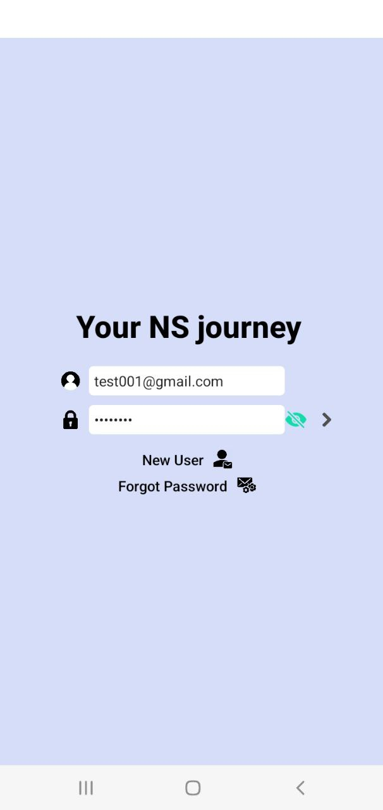
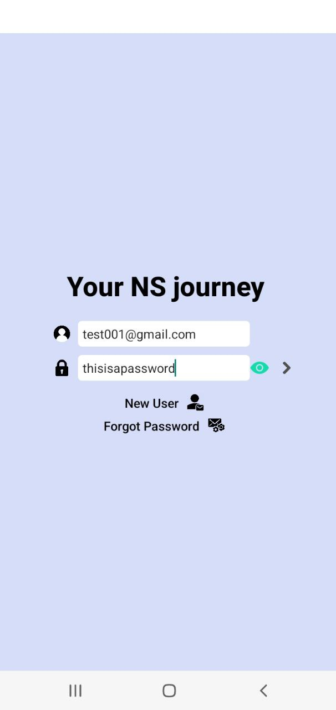
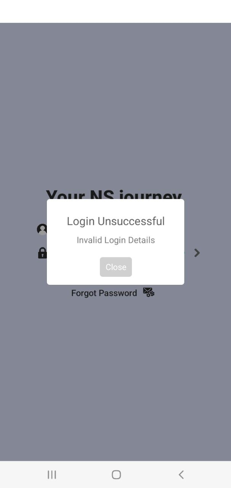
</div>
<br />

### Signup page

<div align="center">
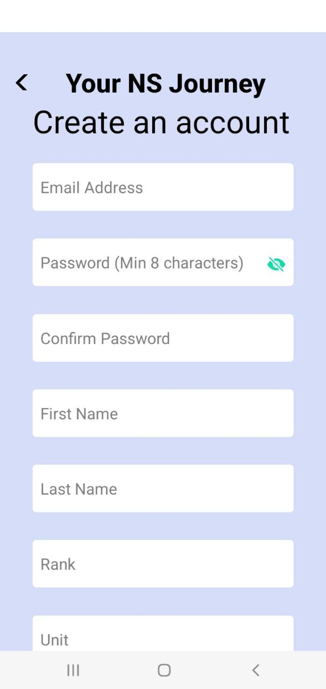
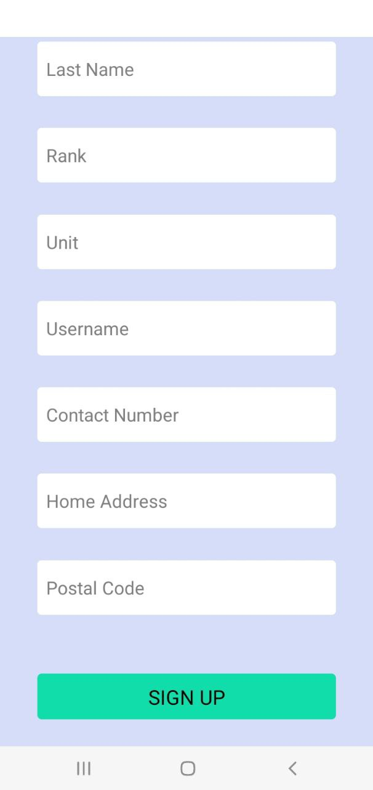
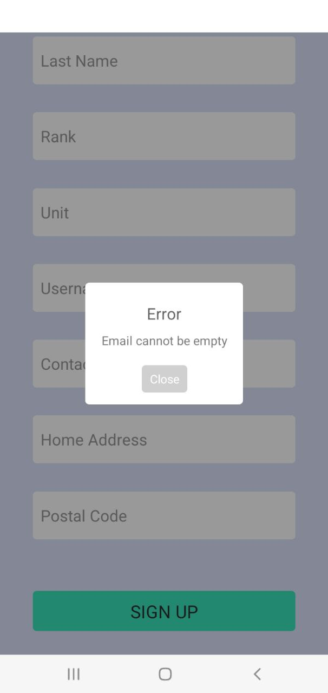
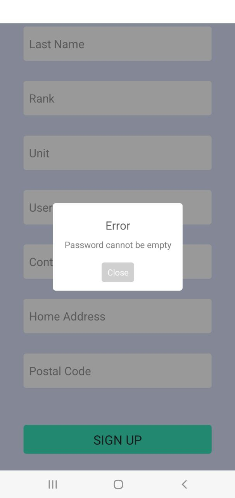
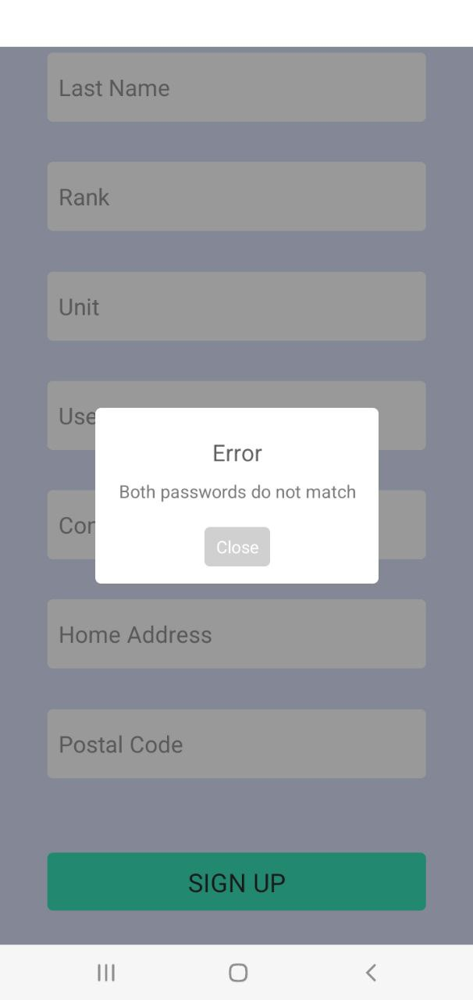
</div>
<br />

### Forget password page

<div align="center">
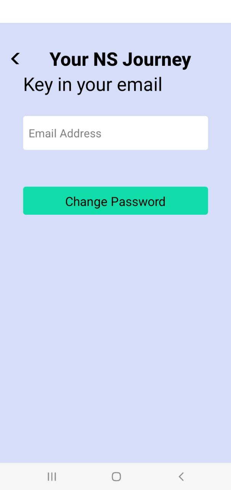
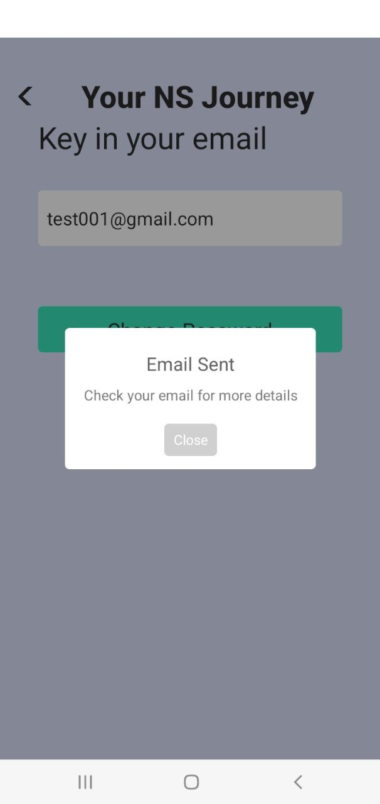
</div>
<br />

### Main interface

<div align="center">
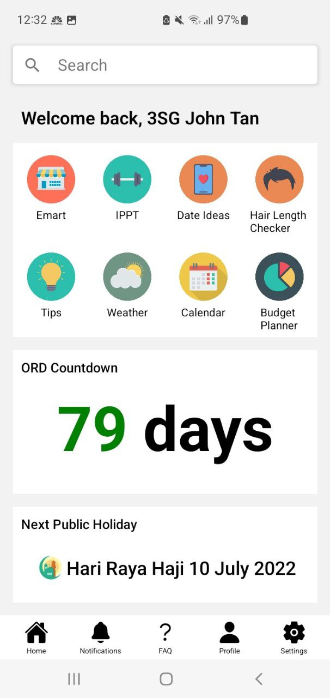
</div>
<br />

### Hair Length Checker

<div align="center">
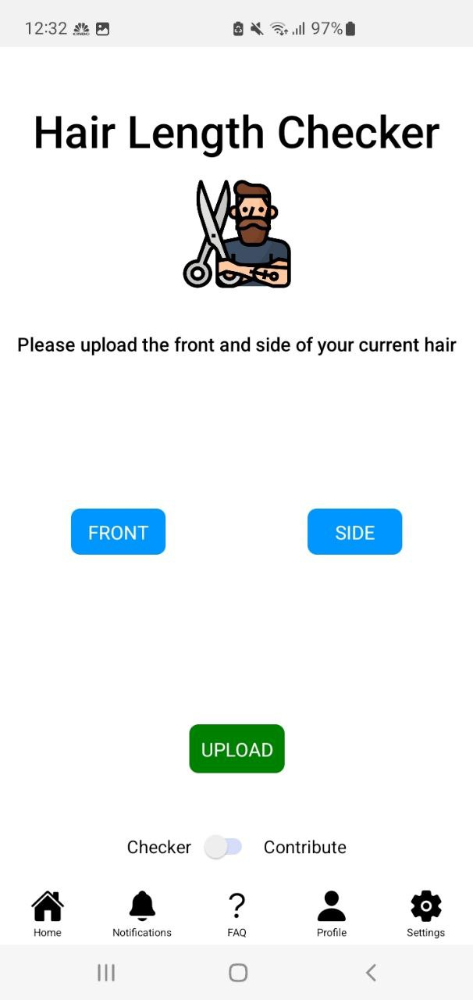
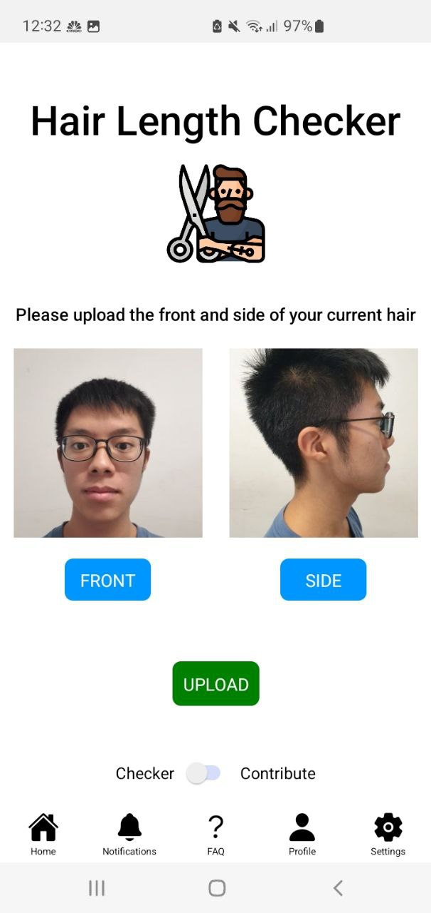
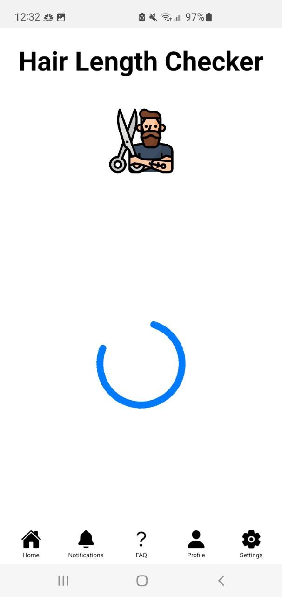
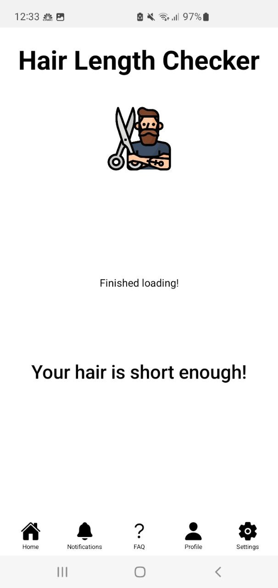
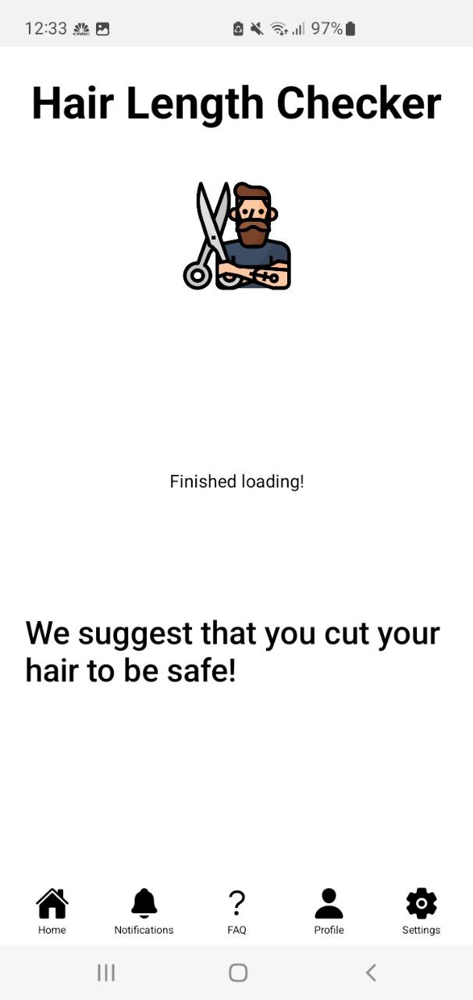
</div>
<br />

### Contribution by commanders

<div align="center">
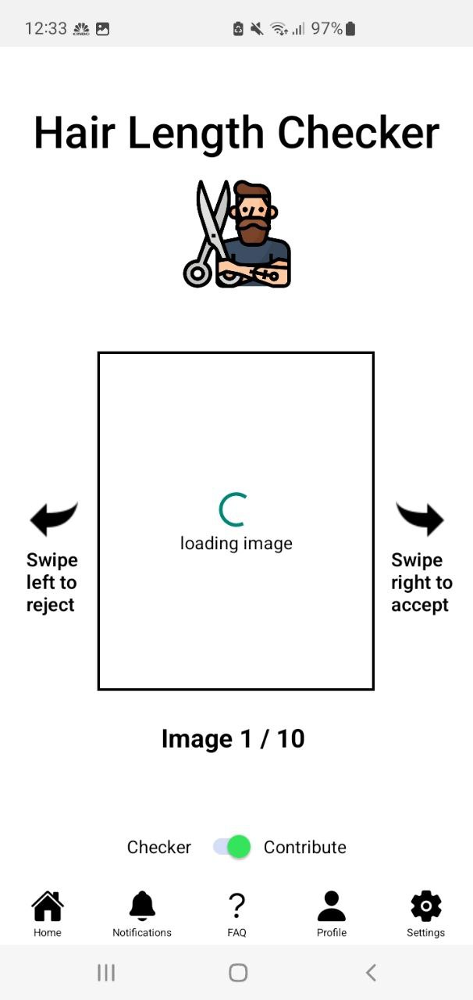
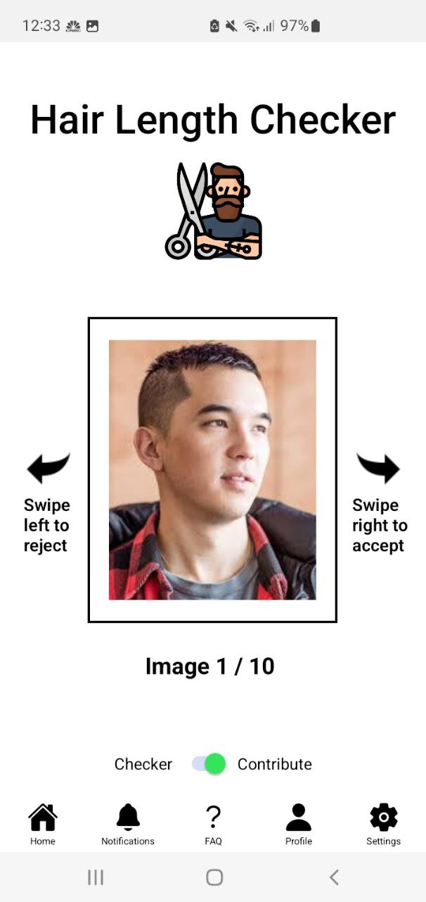
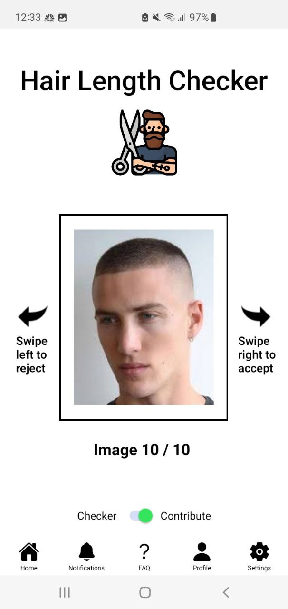
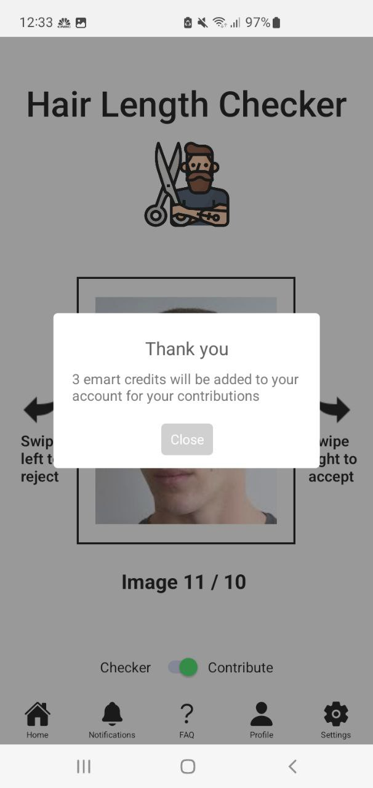
</div>

<p align="right">(<a href="#top">back to top</a>)</p>

<div id="#roadmap"></div>

## Roadmap

### 1. Link model to the main code via RESTful API

Currently, though we have the model, but we are not utilising it in our app as we could not use it directly since it was in python. Thus, we would like to host it on an API so that we can retrieve the result after running images through the model. This would also enable us to optimize the model for the contribution by commanders.

### 2. Financial Budgeting Tool

NSFs may not know how to manage their finances as it is the first time for most of them that they are receiving a relatively large sum of allowance every month. Having a budgeting tool can help NSFs learn to manage their finances.

### 3. Writing data to Firebase database

New users will be required to register themselves via the “New User” screen in the application. After all necessary fields have been filled up correctly, this information will be written in the Firebase database. This information will be retrieved and rendered in the main interface each time the user logs in to the application.

### 4. Resources for pre-enlistees, NSFs and NSmen

Information and guides such as BMT, vocation, command school, and IPPT, ORD, ORNS, date ideas as a NSF and emart availability.

### 5. Enlistment/ORD/ORNS Countdown

Countdown to days left to enlistment/ORD/ORNS.

### 6. Next Public Holiday

Display next public holiday.

<div id="#challenges"></div>
<br />

## Challenges

### 1. Low accuracy of model due to a lack of datasets

We are unable to find quality labelled datasets online to train our model, thus having a low accuracy. However, we plan to mitigate this by collaborating with MINDEF in the future to allow us to use the images uploaded by NSFs and classified by commanders for continuous improvements in the accuracy of the machine learning model. With thousands of enlistees enlisting every month and having to check their hair length weekly, we will soon have a large database to train our model with.

### 2. Retrieving of data from Firebase

When users sign up for an account, they are required to state their rank and unit. This allows us to determine which unit the model should be fine-tuned for when the commanders contribute. Furthermore, the contribution feature is only meant for commanders. However, in the current interface, it can be assessed by all as we have yet to incorporate the reading of data from Firebase to determine the identity of the user. This is also important in accounting for who to reward after they have contributed.

<p align="right">(<a href="#top">back to top</a>)</p>

<div id="#acknowledgements"></div>

<br />

## Acknowledgments

- [README Template](https://github.com/othneildrew/Best-README-Template)
- [VisionEng](https://www.visioneng.org.uk/datasets/)
- [Yolov5](https://github.com/ultralytics/yolov5)

<p align="right">(<a href="#top">back to top</a>)</p>
